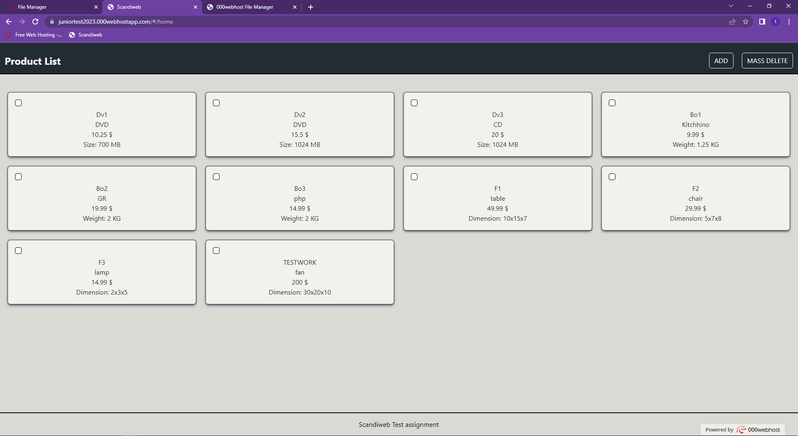
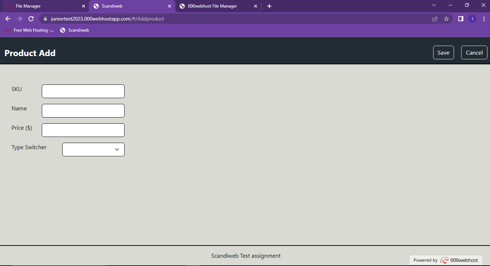
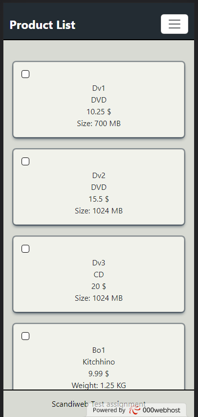
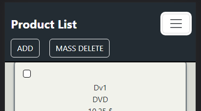
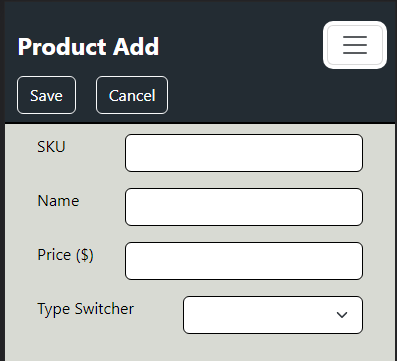
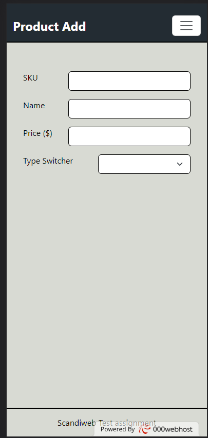

# Scandiweb

This project was generated with [Angular CLI](https://github.com/angular/angular-cli) version 15.1.2.

## Development server

Run `ng serve` for a dev server. Navigate to `http://localhost:4200/`. The application will automatically reload if you change any of the source files.

## Code scaffolding

Run `ng generate component component-name` to generate a new component. You can also use `ng generate directive|pipe|service|class|guard|interface|enum|module`.

## Build

Run `ng build` to build the project. The build artifacts will be stored in the `dist/` directory.

## Product List
This is the main page where products are displayed with the ID order PC view

  

## Product Add
Here you can add products by filling the information  PC view

## Product List
This is the main page where products are displayed with the ID order PC view

    

## Product Add
Here you can add products by filling the information  PC view

 

